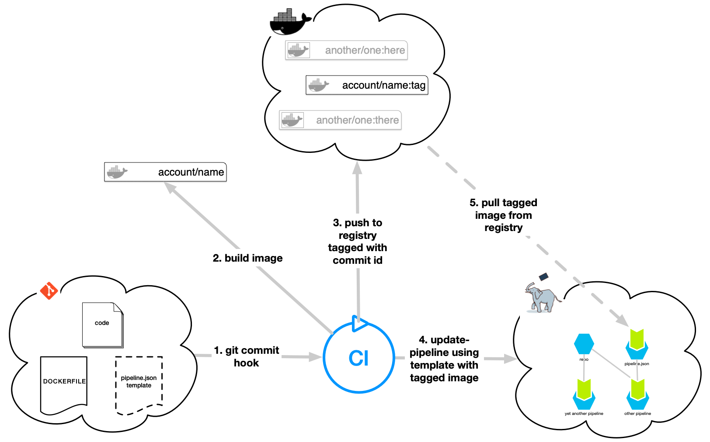

# Example Developer Workflow

## Introduction

Pachyderm is a powerful system for providing data provenance and scalable processing to data scientists and engineers.  You can make it even more powerful by integrating it with your existing continuous integration and continuous deployment workflows. If your organization is fielding a new, production data science application, this workflow can help you by making it the foundation of new CI/CD processes you establish within your data science and engineering groups. In this document, we'll discuss this basic workflow you can use as the basis for your own workflows.

## Basic workflow

As you write code, you test it in containers and notebooks against sample data in Pachyderm repos.  You can also run your code in development pipelines in Pachyderm.  Pachyderm provides facilities to help with day-to-day development practices, including the ``--build`` and ``--push`` flags to the ``update-pipeline`` command, which can build & push or just push images to a local docker registry.

There are a couple of things to note about the files shown in git, in the left-hand side of the diagram above.  The pipeline.json template file, in addition to being used for CI/CD as noted below,  could be used with local build targets in a makefile for development purposes: the local build uses DOCKERFILE and creates a pipeline.json for use in development pipelines.  This is optional, of course, but may fit in with some workflows.

Once your code is ready to commit to your git repo, here are the steps that can form the basis of a production workflow.

### 1. Git commit hook

A [commit hook in git](https://git-scm.com/book/en/v2/Customizing-Git-Git-Hooks) for your kicks off the
Continous Integration/Continuous Deployment process.  It should  use the information present in a template for your Pachyderm pipelines for subsequent steps.

### 2. Build image

Your CI process should automatically kick off the build of an docker container image based on your code and the DOCKERFILE. That image will be used in the next step.

### 3. Push to registry tagged with commit id

The docker image created in the prior step is then pushed to your preferred docker registry and tagged with the git commit SHA, shown as just "tag" in the figure above.

### 4. Update-pipeline using template with tagged image

In this step, your CI/CD infrastructure would use the pipeline.json template that was checked in, and fill in the git commit SHA for the version of the image that should be used in this pipeline.  It will then use the ``pachctl update-pipeline`` command to push it to pachyderm.

### 5. Pull tagged image from registry

Pachyderm handles this part automatically for you, but we include it here for completeness.  When the production pipeline is updated with the ``pipeline.json`` file that has the correct image tag in it, it will automatically restart all pods for this pipeline with the new image.

## Tracking provenance

When looking at a job using the ``pachctl inspect-job`` command, you can see the exact image tag that produced the commits in that job, bridging from data provenance to code provenance.

``pachctl list-job`` gives you  ``--input`` and  ``--output`` flags that can be used with an argument in the form of repo/commit-id to get you complete provenance on the jobs that produced a particular commit in a particular repo.

## Summary

Pachyderm can provide data provenance and reproducibility to your production data science applications by integrating it with your existing continuous integration and continuous deployment workflows, or creating new workflows using standard technologies.
